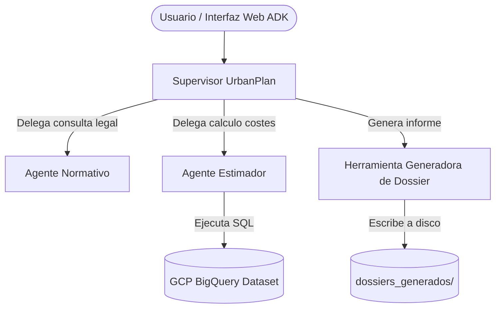

# Memoria del Proyecto: UrbanPlan AI

## 1. Introducción y Objetivo
El objetivo de este proyecto es construir un sistema de inteligencia artificial basado en arquitectura Multi-Agente para el sector del urbanismo y la arquitectura. El sistema está diseñado para asesorar a técnicos y ciudadanos sobre viabilidad legal, presupuestos y plazos de tramitación de licencias urbanísticas. 

Para lograrlo, se ha empleado la librería oficial **Google Agent Development Kit (ADK)** de Vertex AI, aprovechando los modelos de lenguaje `gemini-2.5-flash` y orquestando a múltiples agentes especializados.

## 2. Arquitectura Multi-Agente
La arquitectura implementada consta de un agente orquestador (Supervisor) y dos sub-agentes especialistas, cumpliendo con el requisito de delegación inteligente:

1. **Supervisor (`supervisor_urbanplan`)**: Actúa como el punto de entrada para el usuario. Analiza la petición, determina si requiere asesoramiento legal, estimaciones numéricas o ambas, y delega en el agente adecuado. Además, tiene acceso directo a herramientas externas para la generación de entregables finales.
2. **Sub-Agente Normativo (`agente_normativo`)**: Especialista en la aplicación del Código Técnico de la Edificación (CTE) y regulaciones urbanísticas (BOE, PGOU). Proporciona orientación técnica y legal.
3. **Sub-Agente Estimador (`agente_estimador`)**: Analista de datos especializado en presupuestos y plazos. Su característica principal es que no "alucina" precios, sino que **genera y ejecuta dinámicamente sentencias SQL** contra una base de datos histórica alojada en **Google BigQuery**.

## 3. Base de Datos en BigQuery (Grounding)
Para dotar al sistema de respuestas veraces basadas en datos propios (Grounding), se ha desplegado un entorno en **Google BigQuery**.

- **Automatización (Data Engineering)**: Se ha desarrollado un script en Python (`setup_bigquery.py`) que se conecta de manera programática al proyecto `mlops-entrega` (región `EU`), creando el dataset `agente_urbanistico` y la tabla `licencias_historicas`.
- **Volumen de datos**: La tabla ha sido poblada masivamente con 100 registros realistas generados sintéticamente. Los datos incluyen diferentes tipologías (`Obra mayor`, `Obra menor`, etc.), municipios españoles, metros cuadrados, días de tramitación y presupuesto en euros.
- **Integración**: A través de la clase `BigQueryEstimatorTool`, el agente *Estimador* traduce la petición del usuario a lenguaje natural en una query SQL compleja (con agrupaciones, medias y filtros), extrae los resultados del Cloud y los interpreta para el usuario.

## 4. Model Context Protocol (MCP) / Custom Tooling
El sistema implementa una herramienta nativa basada en el estándar de herramientas locales:
- **Herramienta**: `generate_permit_dossier` (ubicada en `src/urbanplan/mcp_server/dossier_tool.py`).
- **Función**: Permite al Supervisor compilar toda la información recuperada por los sub-agentes (normativa y presupuesto) en un documento estructurado de tipo "Dossier Ejecutivo".
- **Ejecución**: El agente la invoca automáticamente cuando el usuario solicita un informe final, escribiendo un archivo en Markdown (`.md`) en la carpeta local `dossiers_generados/`.

## 5. Pruebas y Validación Local
El despliegue y pruebas del sistema se han realizado mediante la interfaz web local de Google ADK (`uv run adk web src`). 

Durante la validación, el sistema demostró:
1. **Razonamiento SQL autónomo**: Capacidad para cruzar datos y calcular promedios de tasas y tiempos basados exclusivamente en la tabla de BigQuery.
2. **Delegación correcta**: Intervención secuencial de los agentes sin saturación del contexto.
3. **Persistencia**: Escritura exitosa de dossiers utilizando la herramienta integrada.

*(Insertar aquí las capturas de pantalla de la interfaz web de ADK demostrando el funcionamiento de las queries a BigQuery y la generación del Dossier)*

## 6. Conclusión
El proyecto cumple todos los requisitos solicitados:
- Uso de Google ADK y modelos Gemini (`gemini-2.5-flash`).
- Creación de mínimo dos sub-agentes y un supervisor.
- Implementación de Grounding sobre una fuente de datos de BigQuery en Google Cloud Platform.
- Invocación de herramientas (Tools/MCP) para interactuar con el entorno (creación de archivos).
- Empaquetado estandarizado mediante `uv` y Git.
